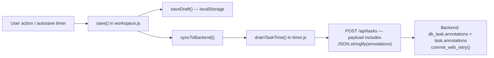
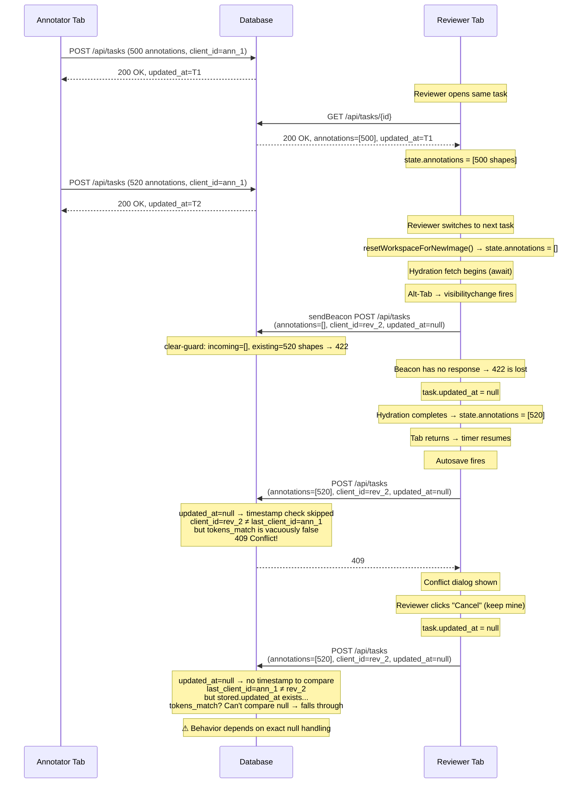

# Annotation Wipe Diagnosis: Reviewer/Owner Opens an Annotated Task

  

## Executive Summary

  

After tracing every code path from frontend save triggers through backend persistence, **three concrete vulnerability windows** exist where a reviewer/owner opening a task can wipe annotations. Two are race conditions in the frontend's task-switch flow, and one is a conflict-resolution loophole that turns a defensive mechanism into a destructive one.

  

> [!CAUTION]

> The most dangerous vector is **#1 below** — the visibility-change beacon firing during the gap between `resetWorkspaceForNewImage()` and task hydration. It requires no user action beyond switching browser tabs.

  

---

  

## How Annotations Are Saved — Background

  

### Storage Model

Annotations are stored as a **single JSON text column** (`Task.annotations` in [`models.py`](file:///E:/icn/annot/project/labelstudio/models.py)) — a stringified JSON array of annotation objects. Every save is a **wholesale replacement** of the entire array. There is no per-annotation table, no diff, no merge.

  

### Save Flow (Frontend → Backend)

  



  

- [`syncToBackend()`](file:///E:/icn/annot/project/labelstudio/frontend/js/components/workspace.js#L111-L154) snapshots `state.annotations` into `currentTask.annotations`, then delegates to `drainTaskTime()`.

- [`drainTaskTime()`](file:///E:/icn/annot/project/labelstudio/frontend/js/components/timer.js#L80-L219) builds the POST payload and sends it. If `annotations` was passed, it serializes it; otherwise it uses `task.annotations`.

- The backend's [`update_or_create_task()`](file:///E:/icn/annot/project/labelstudio/api/routers/tasks.py#L573-L714) replaces `db_task.annotations = task.annotations` wholesale.

  

### Existing Guards

  

| Guard | Location | What it prevents |

|---|---|---|

| **Clear-guard (422)** | [tasks.py:674-691](file:///E:/icn/annot/project/labelstudio/api/routers/tasks.py#L674-L691) | Incoming `[]` when DB already has work, unless `allow_clear=true` |

| **Conflict check (409)** | [tasks.py:613-646](file:///E:/icn/annot/project/labelstudio/api/routers/tasks.py#L613-L646) | Different `client_id` + stale `updated_at` |

| **Permission check (403)** | [tasks.py:576-588](file:///E:/icn/annot/project/labelstudio/api/routers/tasks.py#L576-L588) | User not allowed to write this task |

| **Read-only CSS class** | [canvas-permissions.js:187-189](file:///E:/icn/annot/project/labelstudio/frontend/js/canvas-permissions.js#L187-L189) | CSS disables toolbar for read-only users |

  

### Who Can Write What

  

From [`can_write_task()`](file:///E:/icn/annot/project/labelstudio/api/permissions.py#L354-L420):

  

| Role | Can write any task? |

|---|---|

| Owner / Manager | **Always** — bypasses all assignment checks |

| Reviewer | **Always** — not partitioned by assignment |

| Annotator | Only their assigned tasks |

  

> [!IMPORTANT]

> Owners, Managers, and Reviewers all get `can_write = true` from the server, meaning the frontend allows them to save, autosave, and trigger all write code paths — including ones that send annotations.

  

---

  

## The Bug: Three Attack Vectors

  

### Vector 1: Visibility-Change Beacon Races `resetWorkspaceForNewImage()`

  

**Severity: HIGH — requires zero user action, just a tab switch**

  

#### The Race Window

  

When a task switch occurs in [`switchImage()`](file:///E:/icn/annot/project/labelstudio/frontend/js/init.js#L182-L275), the sequence is:

  

```

1.  Save outgoing task              (line 186-195, awaited)

2.  state.galleryIndex = index      (line 203)

3.  resetWorkspaceForNewImage()     (line 214)

    → state.annotations = []  ← EMPTY

    → clearHistory()

4.  await apiFetch(GET /api/tasks/{id})  (line 224, NETWORK WAIT)

5.  item.annotations = detail.annotations  (line 229)

6.  state.annotations = [...item.annotations]  (line 261, HYDRATED)

```

  

**Between steps 3 and 6, `state.annotations` is `[]`.**

  

During this window, if the user switches to another browser tab (or the browser throttles the tab), [`handleVisibilityChange()`](file:///E:/icn/annot/project/labelstudio/frontend/js/components/timer.js#L497-L514) fires:

  

```javascript

// timer.js line 504-506

if (timerLocalState.isTimerRunning) {

    pausedByVisibility = true;

    pauseTimer({ useBeacon: true });

    const task = currentTaskResolver();        // ← resolves the NEW task

    if (task) drainTaskTime(task, { useBeacon: true });  // ← sends annotations

}

```

  

`currentTaskResolver()` resolves `state.gallery[state.galleryIndex]`, which is already the **new** task (set at step 2). But `drainTaskTime` is called **without** an explicit `annotations` argument, so it falls through to:

  

```javascript

// timer.js line 115

const set = annotations !== undefined ? annotations : task.annotations;

```

  

`task.annotations` at this point is whatever `item.annotations` holds. If the hydration fetch (step 4) hasn't completed yet, `item.annotations` is still `[]` — the empty shell from the gallery list load ([`loadWorkspaceTasks`](file:///E:/icn/annot/project/labelstudio/frontend/js/init.js#L1104)).

  

The beacon payload carries `annotations: "[]"` to the server. Because the reviewer/owner has `can_write = true` and the beacon returns no response (so `updated_at` is nulled), the server's clear-guard is the last line of defense. **If the beacon wins the race, the server correctly rejects with 422** — but:

  

- The beacon gives no response, so the 422 is silently lost.

- `task.updated_at` is set to `null` (line 139), disabling the timestamp half of conflict detection.

- The **next** real save from the same tab uses the empty `state.annotations` (still `[]` if the fetch hasn't returned) and sends it with a normal `POST`, which also triggers the clear-guard 422.

  

However, once the hydration completes (step 5-6), `state.annotations` is repopulated — so the danger window is narrow. The risk increases with:

- Slow network (long hydration fetch)

- Large annotation payloads

- Timer already running (reviewer interacted with canvas)

  

#### But there's a worse variant:

  

If the `GET /api/tasks/{id}` **fails** (network error, timeout), the catch block at [line 243-245](file:///E:/icn/annot/project/labelstudio/frontend/js/init.js#L243-L245) only logs to console:

  

```javascript

} catch (e) {

    console.error("Failed to hydrate task annotations:", e);

}

```

  

**`state.annotations` stays `[]` permanently** for this task. The task's `item.annotations` stays `[]`. Any subsequent autosave or manual save by the reviewer/owner sends `[]` to the server. The clear-guard catches it — **unless** the task on the server also happens to be empty (newly created), or unless the save includes `allow_clear` (manual save with 0 annotations).

  

### Vector 2: The Conflict Dialog "Keep Mine" Path for Owners/Reviewers

  

**Severity: MEDIUM — requires the owner/reviewer to click "Cancel" in the conflict dialog**

  

When a reviewer/owner opens a task that was recently saved by the annotator, the timeline is:

  

1. Reviewer loads `GET /api/tasks/{id}` → gets `updated_at = T1`, `annotations = [500 shapes]`

2. Annotator saves again → DB gets `updated_at = T2`, `last_client_id = annotator_abc`

3. Reviewer's autosave fires → sends `client_id = reviewer_xyz`, `updated_at = T1`

4. Server: `reviewer_xyz ≠ annotator_abc` AND `T1 < T2` → **409 Conflict**

5. Conflict dialog: "OK = reload, Cancel = keep mine and overwrite"

  

If the reviewer clicks **Cancel** (keep mine):

  

```javascript

// init.js line 594-597

task.updated_at = null;  // null token = deliberate overwrite

setStatus("Keeping version (will overwrite)");

```

  

The next autosave sends the reviewer's `state.annotations` — which is the version from step 1 (T1). If the annotator added 50 annotations between T1 and T2, those 50 are now gone. The reviewer **thought** they were keeping their own edits, but they had made none — they were keeping the stale copy they loaded.

  

This is not a code bug per se — the dialog says "keep your version and overwrite." But it is a UX trap: a reviewer who opened a task just to look at it, made no changes, and clicks "Cancel" because they don't want to reload, unwittingly overwrites the annotator's recent work.

  

### Vector 3: Review Actions Update `updated_at` Without Touching Annotations

  

**Severity: LOW-MEDIUM — creates a stale-token window**

  

The [`review_task()`](file:///E:/icn/annot/project/labelstudio/api/routers/tasks.py#L871-L916) endpoint updates `task.updated_at` (line 894) and `task.status` but **does not set `last_client_id`** — because a review action is not an annotation save.

  

```python

# tasks.py line 893-894

task.status = _REVIEW_ACTION_STATUS[payload.action]

task.updated_at = datetime.datetime.now(datetime.timezone.utc)

```

  

After this, the DB's `updated_at = T_review` but `last_client_id` is still whatever the annotator's last save set. The **annotator's** next autosave sends their (stale) `updated_at = T_old`, and the conflict check compares:

  

```python

# tasks.py line 632

if task.client_id != db_task.last_client_id and not tokens_match:

```

  

`task.client_id` (annotator) **does** match `db_task.last_client_id` (annotator) — so **no conflict is raised**, even though `updated_at` advanced. This is correct behavior — the annotator is updating their own task. But the annotator's payload may carry a stale view if they haven't reloaded since the review action. In practice, the annotator sends their full annotation set which is unchanged by the review, so this is safe **unless** the frontend discarded the annotations for another reason.

  

---

  

## The Root Cause Pattern

  

All three vectors share one root cause:

  

> **The frontend's `state.annotations` temporarily holds an empty array `[]` during task transitions, and any save trigger that fires in that window sends the empty set to the server as a wholesale replacement.**

  

The backend's clear-guard (422) catches this for the normal save path, but:

1. **Beacons bypass it** (no response → no rejection handling)

2. **Failed hydration** leaves `state.annotations = []` permanently

3. **The conflict "keep mine" path** resends whatever the client has, which may be a stale or empty copy

  

---

  

## Why Ctrl+Z Sometimes Works

  

[`resetWorkspaceForNewImage()`](file:///E:/icn/annot/project/labelstudio/frontend/js/state.js#L169-L180) calls [`clearHistory()`](file:///E:/icn/annot/project/labelstudio/frontend/js/state.js#L164-L167), which empties the undo stack. But if the wipe happened **within** the same task session (e.g., a save sent `[]` but the local state was restored moments later), the undo stack may still have the pre-wipe snapshot — hence Ctrl+Z works occasionally.

  

Once the user navigates away, `clearHistory()` runs and the undo stack is gone.

  

---

  

## Sequence Diagram: The Primary Wipe Scenario

  



  

> [!WARNING]

> The exact outcome of a `null` `updated_at` depends on which branch of the conflict check fires. When `task.updated_at` is `null` on the client side, the `if task.updated_at:` check at [line 603](file:///E:/icn/annot/project/labelstudio/api/routers/tasks.py#L603) is `False`, so the **entire conflict check is skipped**. The save goes through unconditionally — whatever annotations the reviewer has (520 in this case, or `[]` if the hydration failed) replaces the DB.

  

---

  

## Concrete Findings

  

### Finding 1: `handleVisibilityChange` Sends Annotations Without an Explicit Set

  

**File:** [`timer.js:505-506`](file:///E:/icn/annot/project/labelstudio/frontend/js/components/timer.js#L505-L506)

  

```javascript

const task = currentTaskResolver();

if (task) drainTaskTime(task, { useBeacon: true });

```

  

This calls `drainTaskTime` **without** `annotations`, so line 115 falls through to `task.annotations`. During the `switchImage` race window, `task.annotations` may be `[]`.

  

**Fix needed:** The visibility-change handler should either:

- Not send annotations at all (time-only beacon), or

- Read from `state.annotations` explicitly to get the live canvas state

  

### Finding 2: Failed Hydration Leaves `state.annotations = []` Permanently

  

**File:** [`init.js:243-245`](file:///E:/icn/annot/project/labelstudio/frontend/js/init.js#L243-L245)

  

```javascript

} catch (e) {

    console.error("Failed to hydrate task annotations:", e);

}

```

  

No fallback. `state.annotations` remains `[]`. Any subsequent save sends the empty set.

  

**Fix needed:** On hydration failure, either:

- Retry the fetch, or

- Block saving for that task until hydration succeeds, or

- At minimum, mark the task as not-hydrated so saves are suppressed

  

### Finding 3: Conflict "Keep Mine" Has No Empty-Set Guard

  

**File:** [`init.js:594-597`](file:///E:/icn/annot/project/labelstudio/frontend/js/init.js#L594-L597)

  

When the user clicks "Cancel" (keep mine), the next save sends `state.annotations` with `updated_at = null` — which disables the timestamp conflict check. If `state.annotations` is empty (or stale), the wipe goes through.

  

**Fix needed:** Before allowing "keep mine," check whether `state.annotations` is non-empty and differs from the server's version.

  

### Finding 4: `null` `updated_at` Bypasses All Conflict Detection

  

**File:** [`tasks.py:603`](file:///E:/icn/annot/project/labelstudio/api/routers/tasks.py#L603)

  

```python

if task.updated_at:  # ← False when null

```

  

When the client sends `updated_at = null`, the **entire** conflict detection block is skipped. The only remaining protection is the clear-guard (which checks for empty incoming vs. non-empty existing). If the incoming annotations are non-empty but stale, they silently overwrite the latest version.

  

---

  

## Recommendations

  

| Priority | Fix | Impact |

|---|---|---|

| **P0** | Make `handleVisibilityChange` a time-only drain (no annotations in beacon payload) — the beacon already exists to flush the timer, not to save annotations | Closes the primary wipe vector |

| **P0** | On hydration failure, set a `task._hydrationFailed = true` flag and suppress all saves for that task until retried successfully | Prevents permanent `[]` state |

| **P1** | In the conflict dialog, if `state.annotations.length === 0` and the server has work, change "keep mine" to "your canvas is empty — this would erase the server's annotations. Reload instead." | Prevents empty-set overwrite via conflict resolution |

| **P1** | Backend: when `updated_at` is `null` AND `client_id ≠ last_client_id`, treat it as a conflict (409) rather than skipping the check | Closes the null-token bypass |

| **P2** | Add a `hydrated: boolean` field to gallery items; suppress autosave until `hydrated = true` | Defense in depth for the race window |

| **P2** | Log a server-side warning when annotations go from N>0 to 0 without `allow_clear` (even if cleared by 422) — this would make the wipe visible in logs | Observability |